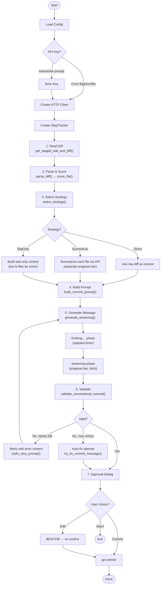
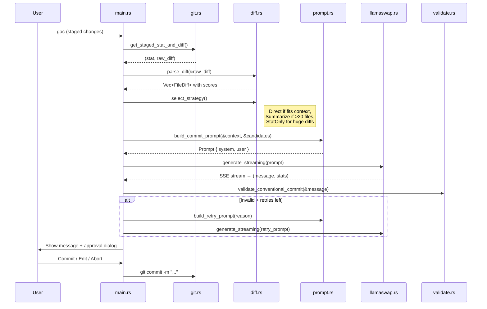

# gac — Architecture Overview

## Overview

`gac` is a Rust CLI tool that generates AI-powered conventional commit messages using a local LLM via [llama-swap](https://github.com/nicholasgasior/llama-swap) (a llama.cpp proxy). It parses staged git diffs, selects a generation strategy based on diff size, builds context-aware prompts, streams the generation, validates the output, and optionally commits.

### Design Principles

- **Low-VRAM first**: Designed for consumer GPUs. Uses streaming to avoid loading full context into VRAM, truncates diffs aggressively, and supports summarization for large changesets.
- **Conventional Commits**: Output is validated against the Conventional Commits spec (`type(scope): description`) with auto-retry and auto-fix.
- **Minimal friction**: Interactive approval dialog with commit/edit/abort, or `--print` for piping. `--quiet` suppresses all UI except the final message.

## Project Structure

```text
gac/
├── src/
│   ├── main.rs       # Entry point, CLI parsing, orchestration, approval dialog
│   ├── config.rs     # Config loading (.gac.toml), scope definitions, API key management
│   ├── crypto.rs     # AES-256-GCM + Argon2id API key encryption at rest
│   ├── diff.rs       # Git diff parsing, priority scoring, strategy selection
│   ├── git.rs        # Git operations (staged files, scopes, excludes, commit)
│   ├── logging.rs    # Custom CLI logging formatter (tracing-based)
│   ├── llamaswap.rs  # llama-swap API client (streaming, tokenize/detokenize, VRAM query)
│   ├── prompt.rs     # Prompt building with Askama templates
│   ├── spinner.rs    # StepTracker, progress spinners/bars (indicatif)
│   ├── stats.rs      # Generation stats display (tokens, VRAM, timing)
│   └── validate.rs   # Conventional commit validation + auto-fix
├── templates/        # Askama templates for system prompts (.md extension)
├── Cargo.toml
├── ARCHITECTURE.md   # This file
└── .gac.toml         # Project config
```

## Functional Areas

```mermaid
graph TD
    subgraph CLI["CLI Layer (main.rs)"]
        MAIN[main] --> CONF[Config]
        MAIN --> GIT[Git Ops]
        MAIN --> DIFF[Diff Engine]
        MAIN --> PROMPT[Prompt Builder]
        MAIN --> GEN[llama-swap Client]
        MAIN --> VALID[Validator]
        MAIN --> UI[StepTracker / Spinner]
        MAIN --> DIALOG[Approval Dialog]
    end

    subgraph GitOps["Git Operations (git.rs)"]
        GIT --> STAGED[get_staged_files]
        GIT --> STATDIFF[get_staged_stat_and_diff]
        GIT --> EXCLUDE[get_excluded_files]
        GIT --> SCOPES[detect_scopes]
        GIT --> COMMIT[git commit]
    end

    subgraph DiffEngine["Diff Engine (diff.rs)"]
        DIFF --> PARSE[parse_diff]
        DIFF --> SCORE[score_file]
        DIFF --> SELECT[select_strategy]
        DIFF --> BUILD_CTX[build_*_context]
    end

    subgraph LlamaSwap["llama-swap Client (llamaswap.rs)"]
        GEN --> STREAM[generate_streaming]
        GEN --> SUMMARIZE[summarize]
        GEN --> TOKENIZE[tokenize / detokenize]
        GEN --> VRAM[query_vram]
        GEN --> CTX_LEN[model_ctx_len]
    end

    subgraph PromptEngine["Prompt Builder (prompt.rs)"]
        PROMPT --> COMMIT_PROMPT[build_commit_prompt]
        PROMPT --> RETRY_PROMPT[build_retry_prompt]
        PROMPT --> SUMMARY_PROMPT[build_file_summary_prompt]
        PROMPT --> TEMPLATES[Askama Templates]
    end

    subgraph Validation["Validation (validate.rs)"]
        VALID --> REGEX[validate_conventional_commit]
        VALID --> AUTOFIX[try_fix_commit_message]
    end

    subgraph UI2["UI (spinner.rs)"]
        UI --> STEPTRACKER[StepTracker]
        UI --> SUMBAR[summarize_bar]
        UI --> SPIN[step_spinner]
    end

    subgraph ConfigLayer["Config (config.rs)"]
        CONF --> LOAD[load]
        CONF --> DEFAULTS[default_excludes]
        CONF --> SAVE[save_api_key]
    end

    style CLI fill:#1a1a2e,stroke:#e94560,color:#fff
    style GitOps fill:#16213e,stroke:#0f3460,color:#fff
    style DiffEngine fill:#16213e,stroke:#0f3460,color:#fff
    style LlamaSwap fill:#533483,stroke:#e94560,color:#fff
    style PromptEngine fill:#533483,stroke:#0f3460,color:#fff
    style Validation fill:#0f3460,stroke:#e94560,color:#fff
    style UI2 fill:#1a1a2e,stroke:#533483,color:#fff
    style ConfigLayer fill:#16213e,stroke:#533483,color:#fff
```



## Execution Pipeline

The main pipeline follows these steps, driven by `StepTracker`:



## Key Data Flow



## Module Responsibilities

| Module | Responsibility | Key Types |
|--------|---------------|-----------|
| `config.rs` | Load cascade (defaults → user → project), scope/exclude definitions | `Config`, `Scope`, `FileConfig` |
| `diff.rs` | Parse unified diffs, score files by relevance, select generation strategy | `FileDiff`, `Strategy`, `ScopeMatch` |
| `git.rs` | Shell out to `git` for staging info, scopes, exclusions, commits | — |
| `llamaswap.rs` | HTTP client for llama-swap API: streaming chat, tokenize, VRAM query | `ChatChunk`, `GenerationStats`, `ModelInfo` |
| `prompt.rs` | Assemble system+user messages from Askama templates | `Prompt`, `CommitSystem`, `ScopeTemplate` |
| `spinner.rs` | `StepTracker` for pipeline progress, summarize bar, VRAM spinner | `StepTracker`, `StepState`, `Step` |
| `stats.rs` | Format and display generation statistics | `GenerationStats` |
| `validate.rs` | Regex validation of conventional commits, auto-fix heuristics | — |
| `crypto.rs` | AES-256-GCM encryption for stored API keys | — |
| `logging.rs` | `tracing` subscriber with custom formatter | `LogLevel` |

## Diff Strategy Selection

The strategy is chosen in `diff::select_strategy()` based on diff characteristics:

| Strategy | When | Behavior |
|----------|------|----------|
| **Direct** | Diff fits within model context window | Full diff sent as prompt context |
| **Summarize** | >20 files changed | Each file summarized individually via API call, summaries combined |
| **StatOnly** | Extremely large diff | Only file names + stat output, top-N by relevance score |

## Configuration Cascade

Config is loaded in order, with later values overriding earlier ones:

1. **Built-in defaults** (excluded file patterns, conventional commit types)
2. **User config** (`~/.config/gac/config.toml`)
3. **Project config** (`.gac.toml` in repo root)
4. **CLI flags** (`--model` only)

## Error Handling

- All errors use `anyhow::Result<T>` with `bail!()` for early returns and `?` for propagation
- No `unwrap()` on user input or network responses
- Validation retries up to 2 times with error context before auto-fix fallback
- Network errors in `generate_streaming` are retried with exponential backoff via `with_retry()`

## Testing

57 unit tests covering:
- `diff.rs`: parsing, scoring, context building, strategy display
- `git.rs`: scope detection, exclusion building, candidate selection
- `llamaswap.rs`: SSE chunk deserialization, message building
- `prompt.rs`: prompt construction with templates and scopes
- `validate.rs`: conventional commit regex, auto-fix heuristics
