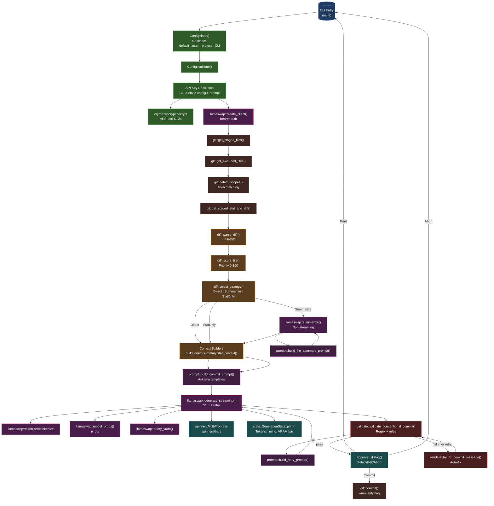

# gac Architecture Documentation

## Overview

**gac** (Git AI Commit) is a Rust CLI tool that generates AI-powered commit messages using llama-swap (llama.cpp proxy). It analyzes staged git diffs, selects an appropriate diff strategy based on token budget, builds prompts with conventional commit rules, streams responses from llama-swap, validates output, and optionally commits.

**Key characteristics:**
- **Async Rust** with Tokio runtime
- **Modular architecture** with 10 focused modules
- **Config cascade**: defaults → user config → project config → CLI overrides
- **Three diff strategies**: Direct → Summarize → StatOnly (adaptive by file count/tokens)
- **Conventional commit enforcement** with auto-retry and auto-fix

---

## Functional Areas (Clusters)

| Cluster | Module(s) | Responsibility |
|---------|-----------|----------------|
| **Cluster 0** | `config.rs` | Config loading (cascade), validation, API key encryption/decryption |
| **Cluster 1** | `logging.rs` | Custom CLI log formatter (symbols, no timestamps unless debug) |
| **Cluster 2** | `diff.rs` | Git diff parsing, priority scoring, strategy selection, context building |
| **Cluster 3** | `llamaswap.rs` | llama-swap API client (streaming, tokenize, detokenize, VRAM stats) |
| **Cluster 4** | `spinner.rs` | Progress indicators (MultiProgress, spinners, bars) |
| **Cluster 5** | `stats.rs` | Generation statistics display (tokens, timing, VRAM bar) |
| **Cluster 6** | `validate.rs` | Conventional commit regex validation + auto-fix |
| **Cluster 7** | `main.rs` | CLI entry point, orchestration, approval dialog |
| **Cluster 8** | `git.rs` | Git operations (staged files, diff, scope detection) |
| **Cluster 9** | `prompt.rs` | Askama templates for system/user prompts (commit, summary, retry) |
| **Cluster 10** | `crypto.rs` | AES-256-GCM encryption for API key storage |

---

## Key Execution Flows

### 1. Main Orchestration Flow (`main`)

```
main()
├── parse CLI (clap)
├── init logging (LogLevel from flags)
├── if init subcommand → init_config() → exit
├── load Config (cascade: defaults → user → project)
├── apply CLI overrides (--model)
├── validate Config
├── resolve API key priority: CLI > env > config > prompt
├── create HTTP client with Bearer auth
├── get staged files (git diff --cached --name-only)
├── filter excluded files
├── detect scopes (glob matching against config.scopes)
├── get stat + raw diff (git diff --cached)
├── parse_diff() → FileDiff[] (sorted by priority)
├── select_strategy() → Strategy + context string
├── build context per strategy:
│   ├── Direct: raw diff
│   ├── Summarize: per-file summarize() → build_summary_context()
│   └── StatOnly: build_stat_context()
├── build_commit_prompt(context, scope_candidates)
├── generate_streaming() → (message, GenerationStats)
├── print stats
├── validate_conventional_commit() with up to 2 retries
├── try_fix_commit_message() on final failure
├── approval_dialog() (unless --print)
└── git commit -m (with --no-verify if flagged)
```

### 2. Diff Strategy Selection (`select_strategy`)

```
select_strategy(client, config, raw_diff, scope_match, stat)
├── parse_diff(raw_diff) → FileDiff[]
├── build_direct_context(FileDiff[]) → context string
├── build_commit_prompt(context, scope_candidates)
├── token_counts(client, config, prompt) → token count
├── fetch model_props() → n_ctx (context window)
├── if tokens < n_ctx → Strategy::Direct
├── else if file_count ≤ 20 → Strategy::Summarize
├── else → Strategy::StatOnly { top_n }
│   └── for each file: tokenize() → fit in budget
└── return (Strategy, context_string)
```

**Thresholds:**
- `SUMMARIZE_THRESHOLD = 20` files
- Context budget from `/props?model=` endpoint

### 3. Summarize Strategy (per-file)

```
for each FileDiff in file_diffs:
    tokenize(file.content) → tokens
    if tokens > budget/2:
        detokenize(tokens[0..budget/2]) → truncated_diff
    else:
        use full content
    build_file_summary_prompt(path, diff_ref)
    summarize(client, config, prompt) → summary
    collect summaries into HashMap<path, summary>
build_summary_context(summaries) → combined context
```

### 4. Streaming Generation (`generate_streaming`)

```
generate_streaming(client, config, prompt, mp)
├── build ChatRequest (model, messages, stream=true)
├── POST /v1/chat/completions (with retry + exponential backoff)
├── start generation_spinner
├── read SSE stream line by line:
│   ├── parse data: {choices:[{delta:{content}, finish_reason}]}
│   ├── on first token: clear spinner, print "💬 "
│   ├── accumulate content
│   └── on finish_reason: extract timings from timings field
├── query_vram(client, endpoint) → GPU stats (best effort)
├── populate GenerationStats
└── return (trimmed_message, stats)
```

### 5. Config Loading Cascade (`Config::load`)

```
Config::load()
├── Config::default() → base
├── if ~/.config/gac/config.toml exists:
│   └── apply_file(user_config) → merge (scopes REPLACE)
├── if .gac.toml found (walk up to git root):
│   └── apply_file(project_config) → merge (scopes REPLACE)
└── return Config
```

### 6. Scope Detection (`detect_scopes`)

```
detect_scopes(staged_files, scopes)
├── for each scope (sorted by name):
│   ├── compile glob patterns
│   ├── check if ANY staged file matches ANY pattern
│   ├── if matched → add to matched[]
│   └── else if no patterns → add to unmatched[]
├── ScopeMatch { matched, unmatched }
└── best_candidates() → matched first, else unmatched
```

---

## Mermaid Architecture Diagram



---

## Data Structures

### `FileDiff` (diff.rs)
```rust
pub struct FileDiff {
    pub path: String,
    pub priority: u8,      // 0-100, higher = more important
    pub content: String,   // full diff including header
}
```

### `Strategy` (diff.rs)
```rust
pub enum Strategy {
    Direct,                    // fits in context window
    Summarize,                 // per-file summaries (<20 files)
    StatOnly { top_n: usize }, // many files: stat + top-N diffs
}
```

### `ScopeMatch` (git.rs)
```rust
pub struct ScopeMatch {
    pub matched: Vec<String>,   // scopes with matched files
    pub unmatched: Vec<String>, // scopes without patterns or no match
}
```

### `Config` (config.rs)
```rust
pub struct Config {
    pub model: String,
    pub endpoint: String,
    pub max_completion_tokens: u64,
    pub exclude_patterns: Vec<String>,
    pub scopes: HashMap<String, ScopeEntry>,
    pub api_key: Option<String>,  // decrypted at load
}
```

### `GenerationStats` (stats.rs)
```rust
pub struct GenerationStats {
    pub input_tokens: u64,
    pub output_tokens: u64,
    pub prompt_eval_ms: f64,
    pub eval_ms: f64,
    pub total_ms: f64,
    pub tokens_per_second: f64,
    pub vram_used_mb: Option<u32>,
    pub vram_total_mb: Option<u32>,
    pub vram_util_pct: Option<f64>,
}
```

---

## Key Design Decisions

| Decision | Rationale |
|----------|-----------|
| **Config cascade** | Flexible: team defaults in user config, project overrides in `.gac.toml`, CLI for one-offs |
| **Three diff strategies** | Handles any repo size: small→Direct, medium→Summarize, large→StatOnly |
| **Priority scoring** | Source files in `src/` get 90, tests 40, configs 20, locks 0 — model sees what matters |
| **Streaming + SSE** | Real-time token display, no buffering, immediate UX feedback |
| **Conventional commit validation** | Enforces `type(scope): subject` with auto-retry (2x) then auto-fix |
| **API key encryption** | Machine-bound AES-256-GCM (hostname+username derived key), no plaintext in config |
| **spinners via MultiProgress** | Single stderr draw target prevents flicker; spinners clear before multi-line output |
| **Askama templates** | Type-safe, compiled prompt templates for system/user messages |

---

## Dependencies Graph (Crates)

```
gac
├── anyhow              # Error handling
├── clap (derive, env)  # CLI parsing + env var support
├── dialoguer           # Interactive prompts (Select, Password, Editor)
├── reqwest (json,stream) # HTTP client + SSE
├── tokio (rt-multi-thread, macros, time) # Async runtime
├── tracing + tracing-subscriber # Structured logging
├── indicatif           # Progress spinners/bars
├── askama              # Template engine for prompts
├── glob                # Scope pattern matching
├── dirs                # Config directory resolution
├── serde + toml        # Config (de)serialization
├── aes-gcm + sha2 + base64 # API key encryption
└── regex               # Conventional commit validation
```

---

## Extension Points

1. **New diff strategy** → Add variant to `Strategy`, handle in `main` match arm
2. **Custom prompt templates** → Add `.md` to `templates/`, new Askama struct in `prompt.rs`
3. **Additional validation rules** → Extend `validate_conventional_commit` in `validate.rs`
4. **New llama-swap endpoints** → Add methods to `llamaswap.rs` following `generate_streaming` pattern
5. **Config fields** → Add to `FileConfig` + `Config`, handle in `apply_file`
6. **Scope matching logic** → Modify `detect_scopes` in `git.rs`
7. **Priority scoring rules** → Adjust `score_file` constants in `diff.rs`

---

## Testing Strategy

- **Unit tests** in each module (`#[cfg(test)] mod tests`)
- **57 tests** covering: diff parsing, scoring, strategy display, scope detection, prompt building, validation, crypto round-trip
- **Integration points** tested via CLI in `main.rs` tests (not yet present)
- **Mock HTTP** not yet implemented for llama-swap API

---

*Generated from GitNexus knowledge graph analysis of the gac codebase.*